# Adobe Experience Manager as a Cloud Service 릴리스 업데이트

Adobe Experience Manager as a Cloud Service의 최신 기능에 대한 간략한 개요를 확인하십시오. AEM 제품 팀에서 제공하는 약 10분 분량의 짧은 비디오로 최신 릴리스의 하이라이트를 공유합니다.

## 최신 업데이트

<table style="max-width: 50%;">
  <tr>
    <td>
      <a href="./2023/2023-1-0.md">
        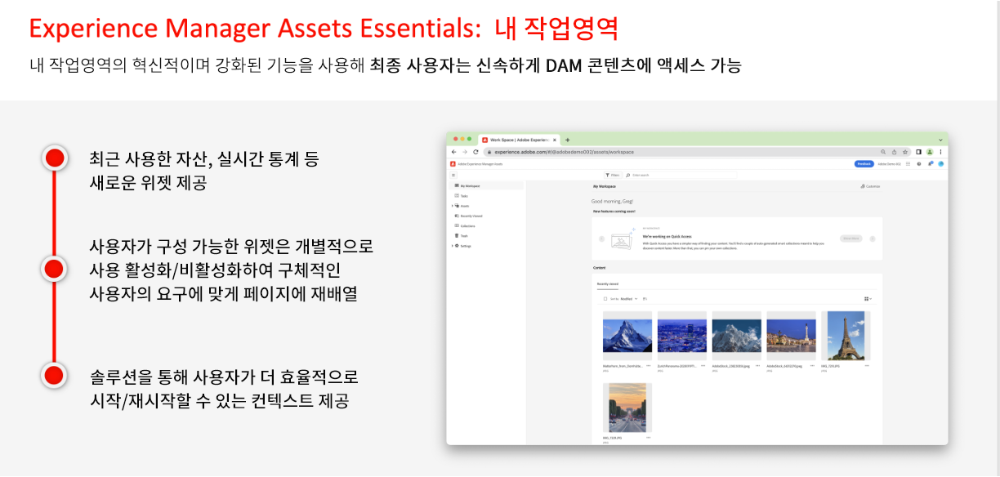
      </a>
      

        <a href="./2023/2023-1-0.md">
          <strong>릴리스 | 2023.1.0</strong>
           
        </a>
          <em>릴리스 일자: 2023년 2월 </em>
      

      

        <a href="https://experienceleague.adobe.com/docs/experience-manager-cloud-service/content/release-notes/release-notes/release-notes-current.html">릴리스 정보</a>
      

    </td>
  </tr>  
</table>

## 지난 업데이트

<table style="max-width: 50%;">
  <tr>
    <td>
      <a href="./2022/2022-10-0.md">
        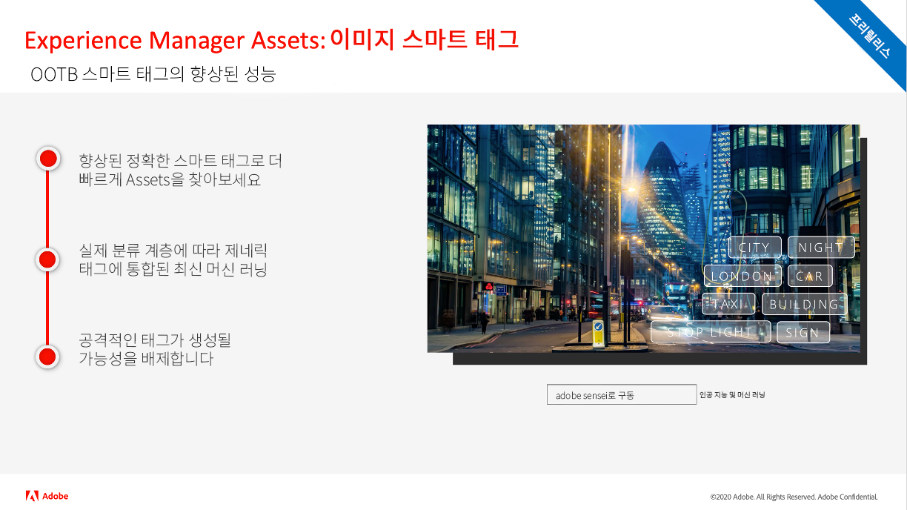
      </a>
      

        <a href="./2022/2022-10-0.md">
          <strong>릴리스 | 2022.10.0</strong>
           
        </a>
          <em>릴리스 일자: 2022년 10월 13일 </em>
      

      

        <a href="https://experienceleague.adobe.com/docs/experience-manager-cloud-service/content/release-notes/release-notes/release-notes-current.html">릴리스 정보</a>
      

    </td>  
    <td>
      <a href="./2022/2022-8-0.md">
        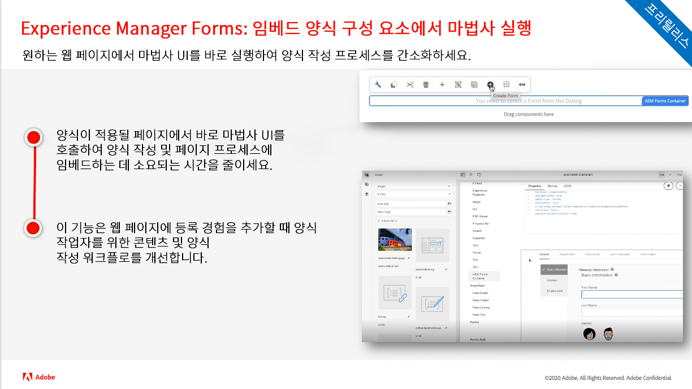
      </a>
      

        <a href="./2022/2022-8-0.md">
          <strong>릴리스 | 2022.8.0</strong>
           
        </a>
          <em>릴리스 일자: 2022년 9월 1일 </em>
      

      

        <a href="https://experienceleague.adobe.com/docs/experience-manager-cloud-service/content/release-notes/release-notes/release-notes-current.html">릴리스 정보</a>
      

    </td>
    <td>
      <a href="./2022/2022-7-0.md">
        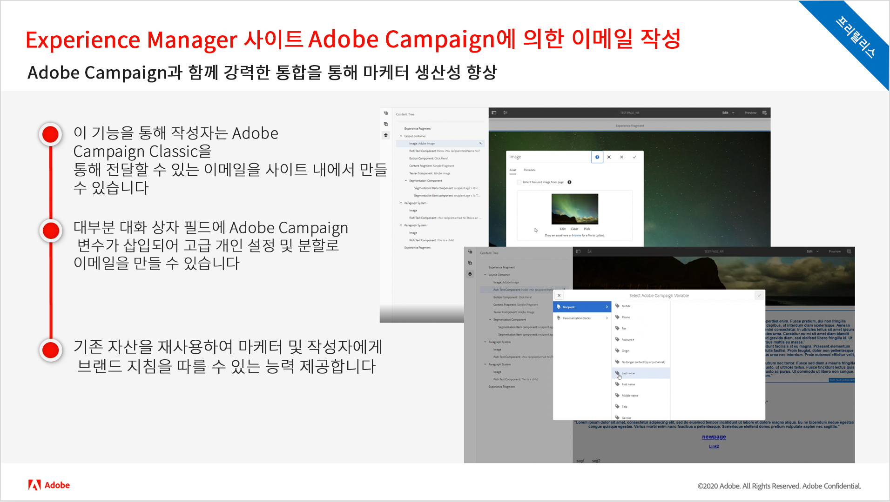
      </a>
      

        <a href="./2022/2022-7-0.md">
          <strong>릴리스 | 2022.7.0</strong>
           
        </a>
          <em>릴리스 일자: 2022년 8월 8일 </em>
      

      

        <a href="https://experienceleague.adobe.com/docs/experience-manager-cloud-service/content/release-notes/release-notes/release-notes-current.html">릴리스 정보</a>
      

    </td>
  </tr>
  <tr> 
    <td>
      <a href="./2022/2022-6-0.md">
        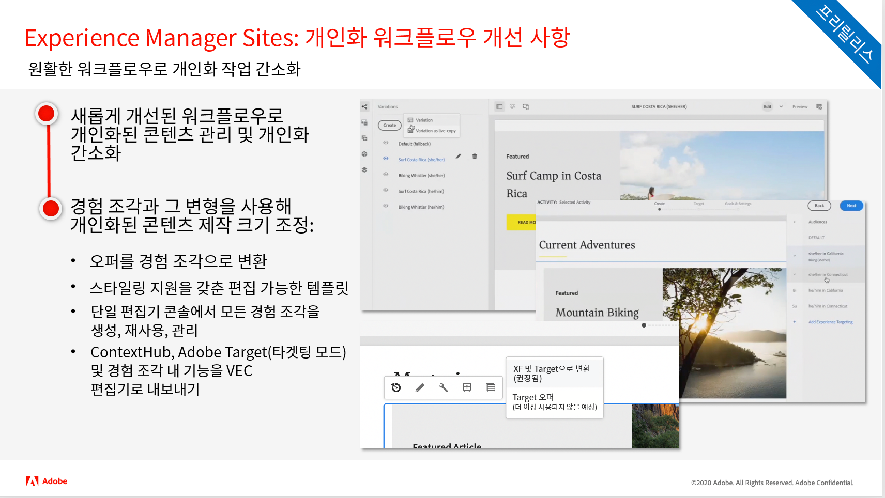
      </a>
      

        <a href="./2022/2022-6-0.md">
          <strong>릴리스 | 2022.6.0</strong>
           
        </a>
          <em>릴리스 일자: 2022년 6월 30일 </em>
      

      

        <a href="https://experienceleague.adobe.com/docs/experience-manager-cloud-service/content/release-notes/release-notes/release-notes-current.html">릴리스 정보</a>
      

    </td>
    <td>
      <a href="./2022/2022-5-0.md">
        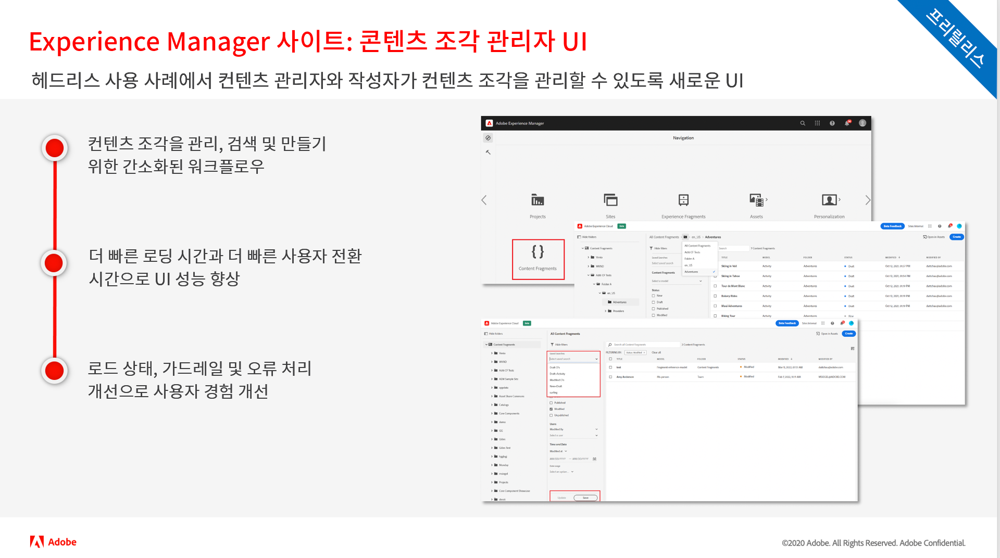
      </a>
      

        <a href="./2022/2022-5-0.md">
          <strong>릴리스 | 2022.5.0</strong>
           
        </a>
          <em>릴리스 일자: 2022년 6월 9일 </em>
      

      

        <a href="https://experienceleague.adobe.com/docs/experience-manager-cloud-service/content/release-notes/release-notes/release-notes-current.html">릴리스 정보</a>
      

    </td>
    <td>
      <a href="./2022/2022-4-0.md">
        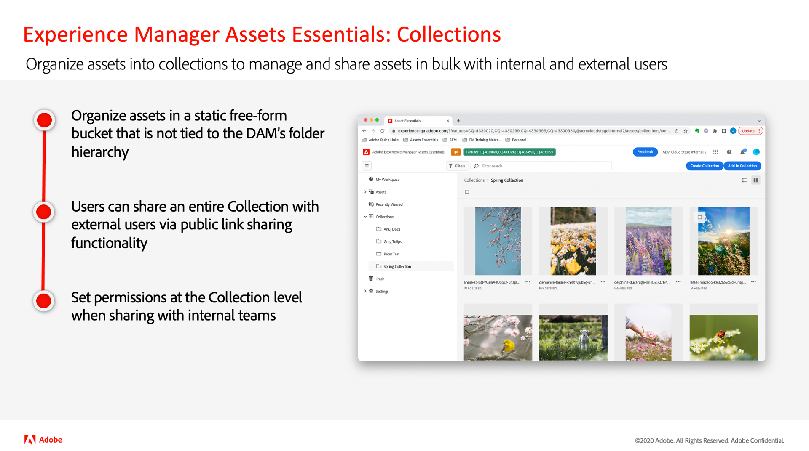
      </a>
      

        <a href="./2022/2022-4-0.md">
          <strong>릴리스 | 2022.4.0</strong>
           
        </a>
          <em>2022년 5월 5일 릴리스됨 </em>
      

      

        <a href="https://experienceleague.adobe.com/docs/experience-manager-cloud-service/content/release-notes/release-notes/release-notes-current.html">릴리스 정보</a>
      

    </td>
  </tr>
  <tr> 
    <td>
      <a href="./2022/2022-3-0.md">
        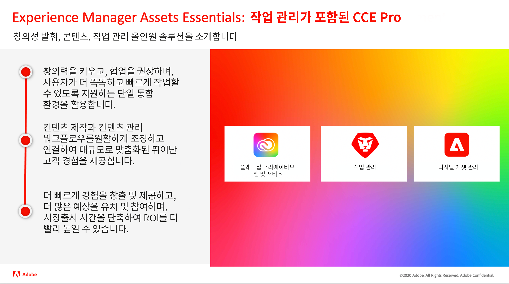
      </a>
      

        <a href="./2022/2022-3-0.md">
          <strong>릴리스 | 2022.3.0</strong>
           
        </a>
          <em>2022년 3월 31일 릴리스됨 </em>
      

      

        <a href="https://experienceleague.adobe.com/docs/experience-manager-cloud-service/content/release-notes/release-notes/release-notes-current.html">릴리스 정보</a>
      

    </td>
    <td>
      <a href="./2022/2022-1-0.md">
        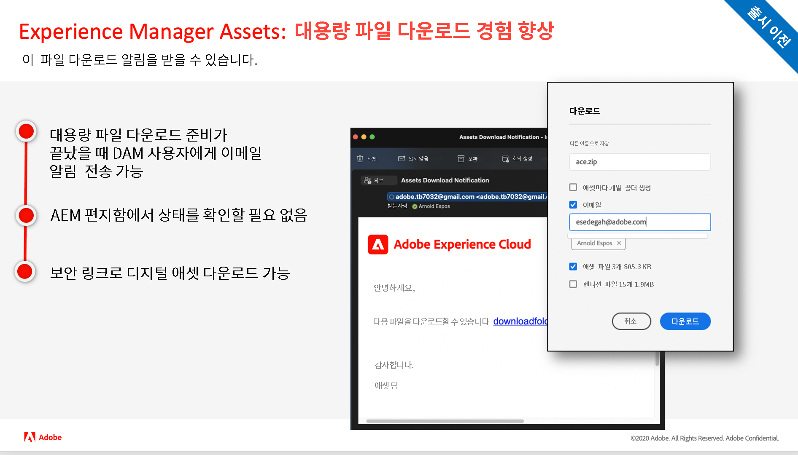
      </a>
      

        <a href="./2022/2022-1-0.md">
          <strong>릴리스 | 2022.1.0</strong>
           
        </a>
          <em>2022년 2월 3일 릴리스됨 </em>
      

      

        <a href="https://experienceleague.adobe.com/docs/experience-manager-cloud-service/content/release-notes/release-notes/2022/release-notes-2022-1-0.html">릴리스 정보</a>
      

    </td>
    <td>
      <a href="./2021/2021-11-0.md">
        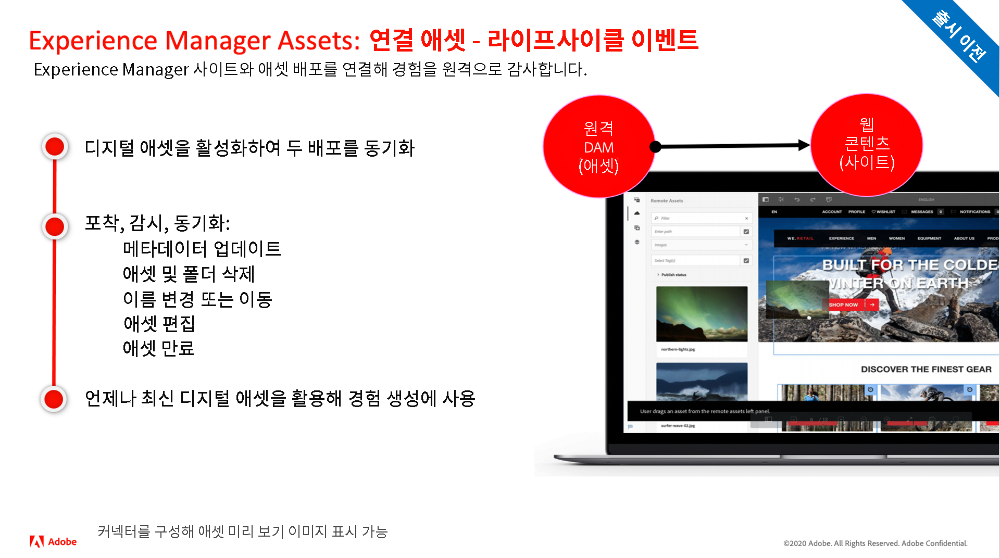
      </a>
      

      <a href="./2021/2021-11-0.md">
          <strong>릴리스 | 2021.11.0</strong>
           
        </a>
      <em>2021년 12월 16일 릴리스됨</em>
      

      

        <a href="https://experienceleague.adobe.com/docs/experience-manager-cloud-service/content/release-notes/release-notes/2021/release-notes-2021-11-0.html">릴리스 정보</a>
      

    </td>
  </tr>
</table>

<!--- 
# Adobe Experience Manager as a Cloud Service release updates

Get a quick overview of the latest features on Adobe Experience Manager as a Cloud Service. These are short, roughly 10 minutes videos delivered by the AEM product team that share highlights of the latest release.

## Latest Update

<table style="max-width: 50%;">
  <tr>
    <td>
      <a href="./2023/2023-2-0.md">
        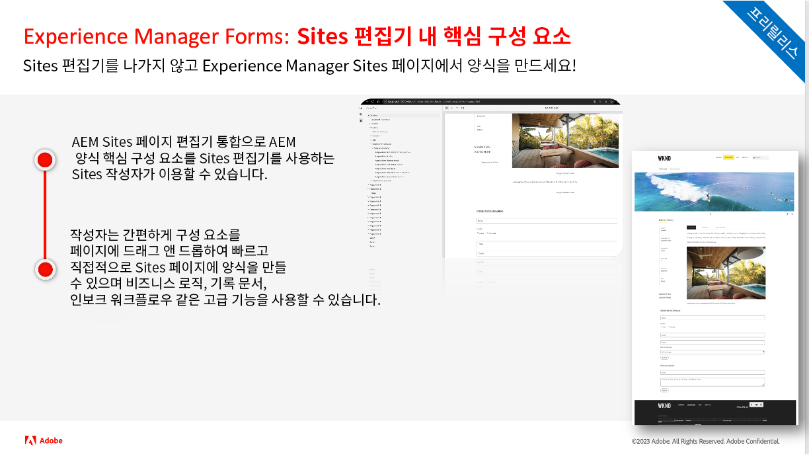
      </a>
      

        <a href="./2023/2023-2-0.md">
          <strong>Release | 2023.2.0</strong>
           
        </a>
          <em>Release date Mar 2023 </em>
      

      

        <a href="https://experienceleague.adobe.com/docs/experience-manager-cloud-service/content/release-notes/release-notes/release-notes-current.html">Release notes</a>
      

    </td>
  </tr>  
</table> 

## Past Updates

<table style="max-width: 50%;">
  <tr>
    <td>
      
      

        <a href="./2023/2023-1-0.md">
          <strong>Release | 2023.1.0</strong>
           
        </a>
          <em>Release date  Feb 2023 </em>
      

      

        <a href="https://experienceleague.adobe.com/docs/experience-manager-cloud-service/content/release-notes/release-notes/release-notes-current.html">Release notes</a>
      

    </td>
    <td>
      
      

        <a href="./2022/2022-10-0.md">
          <strong>Release | 2022.10.0</strong>
           
        </a>
          <em>Release date  Oct 13, 2022 </em>
      

      

        <a href="https://experienceleague.adobe.com/docs/experience-manager-cloud-service/content/release-notes/release-notes/release-notes-current.html">Release notes</a>
      

    </td>  
    <td>
      
      

        <a href="./2022/2022-8-0.md">
          <strong>Release | 2022.8.0</strong>
           
        </a>
          <em>Release date  Sept 1, 2022 </em>
      

      

        <a href="https://experienceleague.adobe.com/docs/experience-manager-cloud-service/content/release-notes/release-notes/release-notes-current.html">Release notes</a>
      

    </td>
  </tr>
  <tr> 
    <td>
      
      

        <a href="./2022/2022-7-0.md">
          <strong>Release | 2022.7.0</strong>
           
        </a>
          <em>Release date  Aug 8, 2022 </em>
      

      

        <a href="https://experienceleague.adobe.com/docs/experience-manager-cloud-service/content/release-notes/release-notes/release-notes-current.html">Release notes</a>
      

    </td>
    <td>
      
      

        <a href="./2022/2022-6-0.md">
          <strong>Release | 2022.6.0</strong>
           
        </a>
          <em>Release date  June 30, 2022 </em>
      

      

        <a href="https://experienceleague.adobe.com/docs/experience-manager-cloud-service/content/release-notes/release-notes/release-notes-current.html">Release notes</a>
      

    </td>
    <td>
      
      

        <a href="./2022/2022-5-0.md">
          <strong>Release | 2022.5.0</strong>
           
        </a>
          <em>Release date  June 9, 2022 </em>
      

      

        <a href="https://experienceleague.adobe.com/docs/experience-manager-cloud-service/content/release-notes/release-notes/release-notes-current.html">Release notes</a>
      

    </td>
  </tr>
  <tr>     
    <td>
      
      

        <a href="./2022/2022-4-0.md">
          <strong>Release | 2022.4.0</strong>
           
        </a>
          <em>Released  May 5, 2022 </em>
      

      

        <a href="https://experienceleague.adobe.com/docs/experience-manager-cloud-service/content/release-notes/release-notes/release-notes-current.html">Release notes</a>
      

    </td>
    <td>
      
      

        <a href="./2022/2022-3-0.md">
          <strong>Release | 2022.3.0</strong>
           
        </a>
          <em>Released  March 31, 2022 </em>
      

      

        <a href="https://experienceleague.adobe.com/docs/experience-manager-cloud-service/content/release-notes/release-notes/release-notes-current.html">Release notes</a>
      

    </td>
    <td>
      
      

        <a href="./2022/2022-1-0.md">
          <strong>Release | 2022.1.0</strong>
           
        </a>
          <em>Released  February 3, 2022 </em>
      

      

        <a href="https://experienceleague.adobe.com/docs/experience-manager-cloud-service/content/release-notes/release-notes/2022/release-notes-2022-1-0.html">Release notes</a>
      

    </td>
  </tr>
</table>

--->